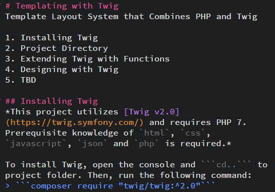
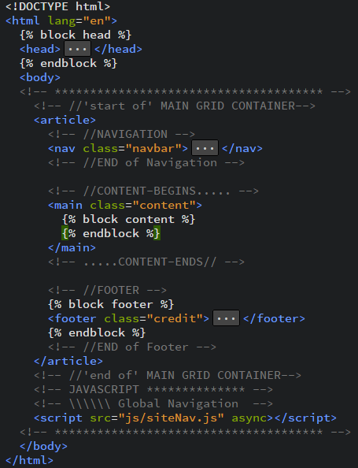
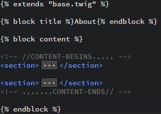
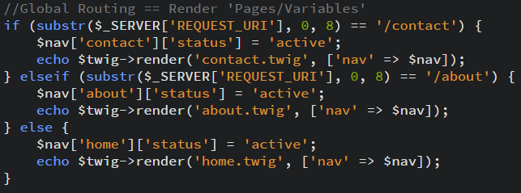

# Templating with Twig
Template Layout System that Combines PHP and Twig

1. Installing Twig
2. Project Directory [Pre-Installed]
3. Project Directory [Dev Installed]
4. Desiging with Twig
5. Building a Navigation System
6. Troubleshooting

## Installing Twig
*This project utilizes [Twig v2.0](https://twig.symfony.com/) and requires PHP 7. Prerequisite knowledge of `html`, `css`, `javascript`, `json` and `php` is required.*

### Use Console to Install
To install Twig, open the console and ```cd..``` to  project folder. Then, run the following command:
> ```composer require "twig/twig:^2.0"```


## Project Directory [Pre-Installed]
Once installation is complete, the project will house the ```vendor/``` folder as well as the ```composer.json``` and ```composer.lock``` files in its directory. *The `.git` file was instantiated when setting up this project on Github. Pay no attention to that `.git` behind the curtain!*


### The ```vendor/``` Folder

The ```vendor/``` folder contains **required project dependencies** for Composer, Symphony and Twig. Working with this folder requires an advanced skillset that is outside of the scope of this project, but there are considerations to keep in mind. 

In an effort to maximize project management efficiency, it is best to upload this folder to the server at a time when the server is least active as this process can be expensive. As well, when creating a project that *does not* require modification of external dependencies, *do NOT* add this folder to version control. To retrieve the most up-to-date version of all required dependencies, run this command:
> ```composer update```

Composer suggests:
> If you are using git for your project, you probably want to add ```vendor/``` to the ```.gitignore```. You really don't want to add all of that third-party code to your versioned repository.

### The ```composer.json``` File 

The ```composer.json``` file is the **root package**, which defines project requirements and is the resource used by developers to declare project dependencies that Composer will manage. Composer uses a JSON schema to provide human and machine readable documentation of this file which can also validate file content.


On instantiation, this file will produce a *package link* that will map ```installed``` package names to versions of the package via version constraints listed in the ```"require":``` property. This project has a singular package and that is version 2.0 of the Twig template engine.

Although some properties are required, recommended, optional or should simply be avoided due to potential for human error, the properties listed below (*to the best of my knowledge*) should be included in the file.

The ```"name":``` property includes the vendor and project name.

The ```"description":``` property includes a package description.

The ```"homepage":``` property includes a URL to the website where the project is hosted.

The ```"time":``` property details the package version release date.

The ```"license":``` property details the package license, if any.

The ```"author":``` property acknowledges project developers using an array of sub-properties that identifies devs by name, email, hompage or role.

Learn more about [basic usage](https://getcomposer.org/doc/01-basic-usage.md), configuring [composer.json](https://getcomposer.org/doc/04-schema.md), using [composer commands](https://composer.json.jolicode.com/), and modifying [JSON Schema](http://json-schema.org) and their properties [properties](https://getcomposer.org/doc/04-schema.md#properties).

### The ```composer.lock``` file 

The ```composer.lock``` file **defines dependencies and vendors** that are currently installed in the ```vendor/``` folder. This file is significant in that the state of dependencies are *locked* in a specified version, and as such, *should always be committed to version control*, which ensures that the same dependencies used during development are also used during production. There is no need to manually modify this file, however, when the time arises to update dependencies, run this command:
>```composer install```


## Project Directory [Dev Installed]
After outlining the ```composer.json``` file with suitable properties, prepare a ```README.md``` file and two folders: one named ```public/``` and another named ```templates/```.


### The ```README.md``` File

The ```README.md``` file is a **form of documentation** that provides users with pertinent information that instructs them on how to implement a project. Provided explanations and screenshots enhances the level of engagement for users, which is encouraging. This file is commonly written using the markdown language, but can be written in any text format. There is no standard practice for writing such a file as the requirements for all projects vary. However, it is common to include instructions for configuration and installation, copyright and licensing information, credits and acknowledgments, a changelog, and troubleshooting ideas, if applicable. 



The above illustration outlines how such a file is written using the markdown language while the illustration below highlights how that markdown will be presented to users. 


Learn more about [README.md](https://en.wikipedia.org/wiki/README), the [cheatsheet](https://www.markdownguide.org/cheat-sheet/) and [how to make a readme](https://makeareadme.com).

### The `public/` Folder

The ```public/``` folder **contains all assets and content that is viewable** by users. To quickly jumpstart a project, it is imperative to include an ```index.php``` file, an ```.htaccess``` file, a ```css/``` folder, an ```img/``` folder and a ```js/``` folder.


The `css/` folder **stores cascading stylesheets that determine the sites presentation**. The styles for this project consist of a `grid.css` file and a `main.css` file.  The former is a stylesheet that employs the `{display: grid;}` declaration on specified sections of a page in order to create an overall grid layout structure. The latter stylesheet contains universal and general styles that adds aesthetic value to the page.

The `img/` folder **stores the screenshots** or other imagery to enhance text content.

The `js/` folder **stores javascript which creates functionality**. This project has a single script, `siteNav.js`, that provides the functionality for the global navigation system.

#### The `.htaccess` File

The `.htaccess` file is **a configuration file that alters the configuration of the Apache Web Server to enable functionality and features** that the server software has to offer. Some common features include password-protection, URL redirects and custom error pages. 


This project file incorporates the `mod_rewrite` module, which uses **a rule-based rewriting engine to rewrite requested URLs**. By default, mod_rewrite maps a URL to a filesystem path. Its initial setup begins by setting up the tag `<IfModule mod_rewrite.c></IfModule>` to contain the following directives:

The `RewriteEngine On` directive **enables (or disables) the runtime rewriting engine**.

The `RewriteBase` directive **specifies the URL prefix** to be used for per-directory (htaccess) `RewriteRule` directives that substitute a *relative path*, and is required when you use a relative path.
*(In Apache HTTP Server 2.4.16 and later, this directive may be omitted when the request is mapped via Alias or mod_userdir.)*

The `RewriteCond` directive **defines a rule condition**. One or more RewriteCond can precede a RewriteRule directive. The following rule is then only used if both the current state of the URI matches its pattern, and if these conditions are met.

The `.htaccess` file can do amazing things, but working with this file depends on the state of that project. During development, this file should be placed in the `public/` folder, however, during production this file should be placed in the root directory. Learn more about the [mod_rewrite rules](https://httpd.apache.org/docs/2.4/mod/mod_rewrite.html).

#### The ```index.php``` File

The ```index.php``` file is essentially **the M-V-Controller** of the project. This file is setup to (a) register the TWIG API, (b) load templates from the `templates/` folder and (c) establish rendering methods for templates and the `$nav` variable that will create the sites overall global navigation. 


The first line **registers a call to the autoloader** (Twig API) using [Composers](https://getcomposer.org) built-in `autoload` function.
> `require_once __DIR__ . '/../vendor/autoload.php';`

This function automates the process for updating dependencies, which will ensure that the latest version for all dependencies are readily available. Without going in-depth, this short line of code does the heavy lifting for the `.json` and `.lock` files. Learn more about Composers [autoload](https://getcomposer.org/doc/01-basic-usage.md#autoloading) function.

The next two lines create an *environment* that accesses the `$loader` variable to properly amalgamate the two. 

The first part establishes the loader, which will **load templates from the file system**, database or other resources. Although absolute paths are supported, relative paths are preferred as it makes the cache keys independent of the root directory.
> `$loader = new Twig_Loader_Filesystem(__DIR__ . '/../templates');`

The second part establishes the environment constructor, which is a **class instance used to store configurations and load templates from other locations**.
> `$twig = new Twig_Environment($loader);`

The constructor can accept a second argument in the form of an an array.
> `$twig = new Twig_Environment($loader, ['debug' => true]);`

Some of the available options include:

| Options | Value |
| ------- | ------- |
| debug | boolean  *(enable/disable node display)*|
| charset | string *(utf-8 template charset)* |
| cache | string *(absolute path to templates)* |
| auto_reload | boolean *(recompiles templates)* |
| autoescape | string *(sets default strategy)* |

Finally, the `if() {} else {}` statement is used to establish **Routing** methods for a global navigation system based on the `$nav` variable defined above it. The line makes use of `($_SERVER['REQUEST_URI'])`, which is a combination of a superglobal variable that, in this case, acts as an array and provides access to specified paths for `<nav>` links. 

All `<nav>` links are written in a logical order so that the statement can direct the user to a desired page using the `render()` method as illustrated below:
> `echo $twig->render('xxx.twig', ['nav' => $nav]);`

The setup for this template system spans three pages and utilizes a routing strategy that is extensible by simply **copying the entire `elseif () {}` statement and modifying page names**. This topic is thoroughly explained in the self-titled section below.

### The `templates/` Folder
The ```templates/``` folder is **a storage facility for the basic layout of a site, and template content that the layout template inherits**. The only kind of files that exist here end with the `.twig` extension.


This project has six templates, but three of them are *extendable components* of the ```base.twig``` file, which is the template that *contains the `html` structure for the site*. This is the *main* template that all other templates **inherit stylesheets and scripts** for a uniform presentation of the site across pages. Unlike other `.twig` files, this file is never rendered, however, it has portable components **included** from other templates that are *implemented* when the file is [extended](https://twig.symfony.com/doc/2.x/tags/extends.html) to other templates. This feature is explained in detail in the *Template Inheritance* section, but the subject offers the perfect segway to dive into designing with Twig!


## Designing with Twig
Twig is a high-performant templating language that is reader-friendly. A template is a text file that can generate any text-based format and is parsed by PHP, containing a mix of text and PHP code. As well, variables, expressions and tags are coded to templates to acquire values once a template is evaluated, and control the logic of the template, respectively. Moreover, templates are automatically cached and re-compiled after any changes are made.

Although Twig code eerily resembles PHP, such tags are not processed due to the fact that Twig templates are compiled to a native PHP class. Familiarity in writing PHP will go a long way when using Twig as features typical of a PHP application can and should be utilized. 

The index.php file described above highlights the influence PHP has in Twig with use of an API call to an autoloader, declared variables, an array with sub-arrays and a global routing system using the if() {} else {} statement to render pages. That said, understanding how to read and write Twig should be a cinch.

### Twig Language Constructs
Twig uses **Delimiters** to order a program to do or say something. The action construct `` tells the program to `do` something: it controls the logic of the template and is used to execute conditionals, for-loops and blocks. The output construct `{{ ... }}` tells the program to `say` something: it will display/print the result of an expression to the template. The comment construct `{# ... #}` tells the program not to render any code written within it. 

When, where and how to use delimiters depends on the objective. All objectives rely on at least one Twig [built-in](https://twig.symfony.com/doc/2.x/) feature. All built-in features are categorized as a [Tag](https://twig.symfony.com/doc/2.x/tags/index.html), [Filter](https://twig.symfony.com/doc/2.x/filters/index.html), [Function](https://twig.symfony.com/doc/2.x/functions/index.html) or [Test](https://twig.symfony.com/doc/2.x/tests/index.html). Tags are the most complex extension point of Twig and are used to modify content before initial rendering. Filters are used to modify variable values, functions are used to generate content and tests are used to evaluate variable expressions. Thus, there is a correlation between these features and variables, which is a good starting point of a template.

#### Working with Variables
**[Variables](https://twig.symfony.com/doc/2.x/templates.html#variables)** are passed to templates for manipulation and may contain attributes or elements that can be accessed. In order to *`Set a Variable`*, use the built-in [`set-TAG`](https://twig.symfony.com/doc/2.x/tags/set.html) feature within the action construct on the template where the variable will be used (the assigned value can be any valid Twig expression): 
>``

Depending on the situation, it may be best to declare a variable from the `index.php` file:
>`render('template.twig', ['varName' => 'varValue']);`

Regardless of method used to set the variable, in order to render the variable in a template, make a call to the variable using the output construct:
>`{{ varName }}`

Use the dot or subscript syntax to access attributes of a variable:
>`{{ foo.bar }}` -or- `{{ foo['bar'] }}`

Utilize the [`attribute-FUNCTION`](https://twig.symfony.com/doc/2.x/functions/attribute.html) feature to access a dynamic attribute of a variable:
>`{{ attribute(object, method, arguments) }}`
   -or-
 `{{ attribute(array, item) }}`


Variables can be implemented in control structures as well, to loop through arrays or test conditionals. Such implementation requires that a variable, with an array of items, be declared from the `index.php` file (as illustrated above) or right above the conditional in the template where it will be used.  Once declared, the variable is then called using the [`for-TAG`](https://twig.symfony.com/doc/2.x/tags/for.html) feature, which will loop over (ie iterate) each item in the array.
The code below, for example, illustrates how the program will iterate through the `varNamE[...]` array, where `varName` is used for each item during looping. In this case, the program will create `3` spans for all three values. 

##### `index.php` File
>`render('template.twig', ['varNamE' => ['varVal1', 'varVal2', 'varVal3']);`


##### `template.twig` File
```html
    <div class="row">
      
        <div class="span3">
          <h2>{{ varName }}</h2>
        </div>
      
    </div>
 ```

The `for-TAG` is a versatile feature that does more than iterate over keys, key-value pairs or a subset: it can also be used to evaluate Twig expressions that incorporate operators and/or invokes the else clause. Moreover, the [loop variable](https://twig.symfony.com/doc/2.x/tags/for.html#the-loop-variable) can be employed within a for-loop block to access special variables.

As previously mentioned, **filters** are used to modify variables and this can be done by using one of the more than two dozen `xxx-FILTER` features. Equally relevant at this juncture is understanding how to use the `filter-TAG` as both are unique to their circumstance. Lets begin looking at the basic construct:
>`{{ varName | filterName }}`

Quite simple: use the output construct and separate the variable from the filter that will be used. Knowing that, lets declare a variable called `name` that has a value (all characters of which are lowercase).
>``

Now, lets use the [`upper-FILTER`](https://twig.symfony.com/doc/2.x/tags/for.html#the-loop-variable) feature on the variable: this filter converts a value to uppercase.'
>`{{ name | upper }}`

Now, lets use the [`filter-TAG`](https://twig.symfony.com/doc/2.x/tags/filter.html) feature. The difference in usage between using a filter and using the filter-tag is that the tag allows designers to apply Twig filters to an entire section of code as opposed to targeting a specific variable. 
>` 
    <p>This text becomes uppercase.</p>
  
`

It should be noted that some filters accept arguments and multiple filters can be chained together, which will go a long way toward producing a dynamic result. This

The information in this section illustrated syntax rules for using variables while employing a built-in tag, filter and function feature. Yet, the code used only touched the surface of the power instilled in the Twig templating language. Although not explored here, test features are equally important to the development of any project: such content will be shared in the 'Troubleshooting' section below. Fortunately, this presents an opportunity to explore valid variable expressions and operators before advancing further with elaborate concepts.

### Expressions and Operators
Twig allows [expressions](https://twig.symfony.com/doc/2.x/templates.html#expressions) everywhere, the simplest form being a Literal, which are PHP data-type representations.

|       Type       |     Value Example      |
|------------------|------------------------|
|   string         |   `"text"` -or- `'text'`   |
|   integer        |   `42`                   |
|   float          |   `02.07`                |
|   boolean        |   `true` -or- `false`      |
|   null           |   `null`                 |
|   array          |   `[ "foo", "bar" ]`     |
|   hash           |   `{ "foo": "bar" }`     |

Be careful not to confuse the use of the hash-type literal, which is defined by a list of key-value pairs separated by a comma and wrapped with curly braces, with that of an array, which is encased in brackets. Furthermore, understand that the hash syntax varies depending on the *type of key* that is being expressed:

|         Key-Type    |          Value Example            |
|---------------------|-----------------------------------|
|   string / hash     |   `{ 'foo': 'foo', 'bar': 'bar' }`  |
|   integer           |   `{ 2: 'foo', 4: 'bar' }`          |
|   expression        |   ``           |
|                     |   `{ (foo): 'foo', (1+1): 'bar'}`    |
|   *Nested in Array   |   ``   |

Simple enough, right? Just keep in mind that in order to implement **String Interpolation**, string literals must be enclosed with double-quoted strings to display any valid expression.  
>`{{ "foo #{bar} baz" }}`

These expressions will be handy when dealing with conditional statements: incorporating operators into the mix will afford designers the ability to create elaboratively concise conditions. Common operators include those that make comparisons, perform math calculations or are logical in nature.

|   Operator    |   Function   |
|---------------|------------------------|
|     ==        |   Equal to             |
|     !=        |   Not Equal to         |
|     <         |   Less Than            |
|     >         |   Greater Than         |
|     >=        |   Greater Than or Equal to   |
|     <=        |   Less Than or Equal to   |
|     +         |   Add Values           |
|     -         |   Subtract Values      |
|     *         |   Multiply Values      |
|     /         |   Divide Values        |
|     %         |   Return the Remainder   |
|     **        |   Power Value          |
|     and       |   Returns TRUE if Both Operands are True   |
|     or        |   Returns TRUE if Either Operand is True   |
|     expr      |   Groups an Expression   |
|     ~         |   Converts Operands to Strings / Concatenates  |
|     ..        |   Create a Sequence (of Letters / Numbers)   |
|     expr      |   Groups an Expression   |

There are also operators that are useful when testing and those are elaborated upon in the 'Troubleshooting' section. Expressions and operators are used invariably throughout traditional programs, and will most often be put to use with the [if-TAG](https://twig.symfony.com/doc/2.x/tags/if.html) feature, which is used to test how an expression evaluates.


### Template Inheritance
In the **`templates`** folder sub-section, reference was made to the fact that templates inherit layout presentation from a main template. The name of the main template in this project is the `base.twig` file.



What makes this file special is that all other templates will inherit its foundation to support themselves in a way that will provide the site with a uniform presentation. On the surface, this file looks like a typical `<html>` document: it has a `<!DOCTYPE html>`, a `<head>` section, and a `<body>` section that houses the sites `global navigation`, a `content` area and a `footer`. Upon closer inspection, however, a key Twig built-in feature is employed.

The [`block-TAG`](https://twig.symfony.com/doc/2.x/tags/block.html) sets the tone for template inheritance as it is used to define sections of a page (like a placeholder) that child templates can modify for individual page relevance. The parent-template invokes this tag three times: in the `<head>`, the `<body>` and the `<footer>`. The syntax is like what was done previously with the `filter-TAG`: 
> ` <htmlTag>...<htmlTag> `


Where used in the `<head>`, it allows modification of the browser-tab title, specifically, and anything else within it. This is also true when used in the `<footer>`.


This section is perfectly setup to be used in child-templates for content to be added. Of the three sections, the `<body>` could possibly be the only section that is modified outside of the parent-template.  

With blocks set, attention shifts to extending the template and this is done using the [`extends-TAG`](https://twig.symfony.com/doc/2.x/tags/extends.html), which will extend the layout structure to child-templates by prompting the templating engine to evaluate the base template immediately prior to rendering a child template; it is in this instance that parent-blocks are overridden by child-blocks. 
When employed, it must be placed on the first line of the template. 
> ``

After that, apply any `block` tags from the parent-template to the child and modify its content.



This child-template will:
- inherit the parent-template via the `extends` tag
- modify the contents of the `title-block`
- inject page content into the `content-block`
- value of `footer-block` is not defined (nothing replaced)

Although the `extends` tag is used only once per template, the `block` tag will be utilized extensively throughout a project. Thus, it is important to keep in mind that not all defined parent-template blocks must be implemented; blocks can be nested and can access variables from outer scopes; improve block readability by adding named end-tags; it is not possible to define multiple block tags with the same name in the same template.

Aside from extending the entire layout of a parent-template to a child-template, Twig allows extending the entirety of a content-block from a child-template to another child-template.  This is done using the [`include-FUNCTION`](https://twig.symfony.com/doc/2.x/functions/include.html) to return the rendered content of a template:
>`{{ include('template.html', {foo: 'bar'}) }}`

Included templates can access variables of the active context as well as variable defined in the parent-template.  This function offers five arguments, only one of which is necessary and that is the `name` of the template to render. Optional arguments include `with_context` set to false to disable access to the context; `ignore_missing` set to true to return an empty string if the template does not exist; and `sandboxed` set to true when including an end-user created template.

### Output Escaping
There are times when generating `<html>` from a template that a variable will include characters that affects the `<html>`. For such instances, in is pertinent to [escape that output](https://twig.symfony.com/doc/2.x/templates.html#heml-escaping). With Twig, everything is automatically escaped by default as a security mechanism for user entered data, but the [environment options](https://twig.symfony.com/doc/2.x/api.html#environment-options) are wholly configurable. 

Developers are responsible for escaping variables when manual escaping is enabled.  One means to achieve this objective would be to use the [escape](https://twig.symfony.com/doc/2.x/filters/escape.html) filter which escapes a string for safe insertion into the final `<html>` output:
>`{{ user.username | escape }}` -or- `{{ user.username | e }}`

In the example above, the `e` expression respresents an alias of the escape filter. Regardless, this filter can be used in contexts other than `<html>` in the form of an optional argument, which can be made to define the escaping strategy as, for example, JavaScript:
>`{{ user.username | escape('js) }}` 

In the event that manual escaping is enabled, but there are variables whose markup should not be escaped, pipe the [raw-FILTER](https://twig.symfony.com/doc/2.x/filters/raw.html) to that variable to mark its value as being safe, thus, it will not be escaped.

The escape strategies notated above should be used when trying to escape the output of a single variable. In order to escape a section of a template to be escaped, it is best practice to utilize the [autoescape-TAG](https://twig.symfony.com/doc/2.x/tags/autoescape.html). 
>` Output As-Is `

This tag accepts an escape strategy argument as well as use of the raw filter.
```
 
  {{ safe_value|raw}} 

```

For large amounts of complicated content that does not require parsing, invoke the [verbatim-TAG](https://twig.symfony.com/doc/2.x/tags/verbatim.html); this tag allows developers to display content as-is, in spite of its context.
```
 
  <ul>
    
      <li>{{ item }}</li>
    
  </ul>

```


## Building a Navigation System
The setup for the navigation system used in this project was created based on the following procedures: 
1. Define the `$nav` Variable
2. Create `.twig` File to Contain `<nav>` 
3. Pass the `.twig` File to `base.twig`
4. Setup `<nav>` Routing

The `$nav` variable is an array object defined in the `index.php` file. 


The array is composed of three inner-array items that contain `href`, `caption` and `status` properties, whose properties assign directory paths, list page name and ascertains page status, respectively. These properties are utilized across all pages, so establishing the criteria first is vital for creating a consistent flow. This array is passed directly to the `render()` method as an argument when setting up routes. The argument `['nav' => $nav]` helps facilitate navigational functionality based on the users selection

Once the `$nav` variable is defined, their sub-array properties can be applied to `<nav>` HTML structure, the markup for which is housed in the `base.twig` and `nav-item.twig` files.


The `nav-item.twig` file is setup as the `<li>...</li>` HTML that will be *included* into the `base.twig` file. This `<li>` accesses all `$nav` variable properties through use of the Twig **variable syntax**:
> `{{ item['xxx']}}` or `{{ item.xxx}}`


In the `base.twig` file, the `<ul>...</ul>` invokes a *for Loop* to loop through all items (ie pages) in the `$nav` array while including the `<li>` markup derived from the `nav-item.twig` file. Failure of the conditional statement here will return the user to the homepage.

#### Routing

Back in the `index.php` file, utilize the `if() {} else {}` conditional statement to establish routes and render methods for all items, that is, the site pages. 



This statement uses the `substr()` function to *return a portion of a string specified by the start and length parameters* from the `$_SERVER[]` variable, which is a superglobal array that holds item/page *path* information. The `['REQUEST_URI']` array item *provides access to a specified URI* while the length of characters to check totals eight. The superglobal is then *compared against* the desired link: `'/pageLink'`. The formula used here, `if(){...} elseif() {...}...` can be repeated for every added page outside of the homepage.

#### Rendering
The code after the `} else {` at the bottom of the statement illustrates the ease of *rendering* a template. Simply modify the `$nav` inner-array properties to match the page and stage the `.twig` file to be used.


## Troubleshooting
When working with any programming language, there will be times when the actual code will need to be tested. There will also be times when the project itself requires detailed explanation and/or instructions for how to work with the project. These two situations are properly dealt with here.

### Troubleshooting `<code>`
As was mentioned previously, expressions are everywhere and, when combined with operators, are useful for producing conditional statements. The operators shared above were used to compare, do math and add logic to conditional statements: those shared here focus solely on testing (**comparative and logical operators are equally used during testing**). Put these operators to use by enclosing them within an [if-TAG](https://twig.symfony.com/doc/2.x/tags/if.html) in similar fashion as was previously noted. In the example below, the comparative `equal-to` operator is used to test if the expression evaluates to true:
```

  <p>Website in maintenance mode.</p>
`
```

Two other means to make comparisons involve the `starts with` and `ends with` comparative operators, which are good for checking if a string starts-with or ends-with another string. In the examples below, both expressions would evaluate to `true`.
>` `
>` `

The containment operators (`in`) can be used to perform containment test, which returns `true` if the left operand is contained in the right: consider it a check of an item within an array.
>`{{ 'cd' in 'abcde' }} -or- {{ 1 in [1, 2, 3] }}`

The test operator (`is`) can be used to evaluate the value of a variable against a common expression, which returns `true` if the variable **is** what the right operand equates to. In the example below, the output construct is used instead of the action construct and is used in conjunction with the [odd-TESTS](https://twig.symfony.com/doc/2.x/tests/index.html) feature, which will evaluate to `true` if the given number is odd:
>`{{ variable is odd }}`

The containment and test operators can be used to check if an expression evaluates to `false` as well by using the `not` negation operator.
>` `
>` `

These can be written a different way:
>`{% if not (1 in [1, 2, 3] )} `
>` `

When testing multiple conditions, use the `and` or `or` operators:
```

  <p>Great weather for a walk.</p>

```

The if tag will be a valuable asset when using operators to test code, but it can become a powerful tool to test complex expressions by using `elseif` and `else` branches:
```
{ % if student.grade >= 95 %}
  <p>Great job</p>

  <p>Good job</p>

  <p>Better luck next time!</p>

```
That said, the ternary operator (`?`) offers a shorthand of sorts for the conditional `if-else` statement. 

|       Converts this...       |     ...into this.      |
|------------------|------------------------|
|   `if (hungry) {haveCake(); } else { eatCakeToo(); }`         |   `hungry ? 'haveCake()' : 'eatCakeToo()'`   |

This is a great start for unit testing, but Twig has several [Tests](https://twig.symfony.com/doc/2.x/tests/index.html) features not described here that will be equally useful. If comfortable with the command line, there are commands that can be used to check a file or a directory for syntax errors:

|   Check a File   |   `php bin/console lint:twig templates/home.twig`     |
|------------------|------------------------|
|   Check a Directory   |   `php bin/console lint:twig templates/`   |


### Troubleshooting Project Annoyances
There are a few annoyances with this project depending on its state: development versus production. *Out of the box, this **project works well in development**.* Not so much the case when uploading the project to the server. Thus, there are a few things to consider when things go wrong:

A. Must Specify Template During Edit.
On `line 38` of the `index.php` file, modify the `.twig` file to be rendered so that the page listed reflects the page that needs to be edited. For example, the `about.twig` file needs to be edited, so configure that line to reflect this: 
> `echo $twig->render('about.twig');`

B. Amend ALL `href=""` paths for any `.css` or `.js` file stored in the `base.twig` file with `public/`. During production, this link
> `href="css/fileName.css"`

should look like this link
> `href="public/css/fileName.css"`


C. Amend the `src=""` path for *ALL* images. During production, the path for this image
> `src="img/fileName.jpg"`

should look like this link
> `src="public/img/fileName.jpg"`

D. Place the `.htaccess` file at the *root* of the directory when uploading to the server so that it is a sibling of the `public/` directory as opposed to it being one of its children.

E. [NOT implemented here~]
**ONLY 'cache' templates during production, NOT when in development!
> `['cache' => "false"]


## * ~TO BE CONTINUED~ *
<!--
Variables can be accessed in any `xxx.twig` file by  placing the variable (without the '$') inside of **Output Tag**.
'>' `{{ variable }}`
*EXPLAIN: Add Filters/Functions to 'Output TAGS'
-->
